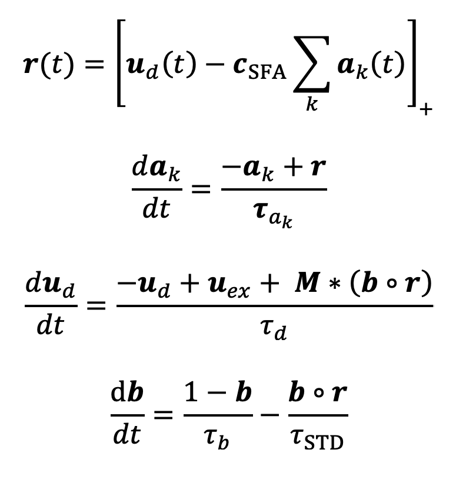

# StableRandomNonlinearNetsJulia

This is the **Julia implementation** of Stable Random Nonlinear Networks (SRNNs) - recurrent neural networks with adaptive weights and biases. This project investigates two forms of adaptation found in the brain: (1) weight adaptation (short-term synaptic depression, STD) and (2) bias adaptation (spike frequency adaptation, SFA).

## Related Implementations

- **MATLAB version** (original): [https://github.com/TomRichner/StableRandomNonlinearNets](https://github.com/TomRichner/StableRandomNonlinearNets)
- **Python version**: [https://github.com/TomRichner/StableRandomNonlinearNetsPy](https://github.com/TomRichner/StableRandomNonlinearNetsPy)

## Mathematical Model

The SRNN model consists of continuous-time recurrent neural networks with the following dynamics:



### Model Equations

**Rectified Neural Activity:**
```
r(t) = [u_d(t) - c_SFA * Σ_k a_k(t)]_+
```

**Spike Frequency Adaptation (SFA):**
```
da_k/dt = (-a_k + r) / τ_a_k
```

**Dendritic Dynamics:**
```
du_d/dt = (-u_d + u_ex + M * (b ∘ r)) / τ_d
```

**Short-Term Depression (STD):**
```
db/dt = (1 - b) / τ_b - (b ∘ r) / τ_STD
```

Where:
- `r(t)` is the neural firing rate (rectified)
- `u_d(t)` are the dendritic potentials
- `u_ex(t)` is external input
- `a_k(t)` are the SFA state variables
- `b(t)` are the STD state variables
- `M` is the connectivity matrix
- `∘` denotes element-wise multiplication
- `[·]_+` denotes rectification (ReLU)

## Installation and Setup

1. **Install Julia** (version ≥ 1.6 recommended)

2. **Clone this repository:**
   ```bash
   git clone https://github.com/YourUsername/SRNN_Julia.git
   cd SRNN_Julia
   ```

3. **Activate the project environment:**
   ```julia
   using Pkg
   Pkg.activate(".")
   Pkg.instantiate()
   ```

## Quick Start

### Basic Example

Run the basic example to see the SRNN in action:

```julia
using Pkg
Pkg.activate(".")

include("examples/basic_example.jl")
```

This example demonstrates:
- A 10-neuron network with excitatory/inhibitory neurons
- External stimulation with sinusoidal inputs
- SFA and STD adaptation mechanisms
- Lyapunov exponent calculation for stability analysis
- Trajectory visualization

### Custom Usage

```julia
using SRNN
using Random

# Set up network parameters
n = 20  # number of neurons
EI = 0.8  # fraction of excitatory neurons
sparsity = 0.7  # network sparsity
w = Dict("EE" => 1.0, "EI" => 1.0, "IE" => 1.0, "II" => 0.5)

# Generate connectivity matrix
M, EI_vec = generate_M_no_iso(n, w, sparsity, EI)
E_idx, I_idx, n_E, n_I = get_EI_indices(EI_vec)

# Define adaptation parameters
n_a_E = 3  # number of SFA timescales for E neurons
n_b_E = 1  # number of STD timescales for E neurons
tau_a_E = [0.3, 1.0, 5.0]  # SFA timescales
tau_b_E = [2.0]  # STD timescales
c_SFA = (EI_vec .== 1) .* (1.0 / n_a_E)  # SFA strength
F_STD = Float64.(EI_vec .== 1)  # STD strength

# Package parameters
params = package_params(
    n_E, n_I, E_idx, I_idx,
    n_a_E, 0, n_b_E, 0,  # adaptation only in E neurons
    tau_a_E, nothing, tau_b_E, nothing,
    0.025,  # dendritic time constant
    n, M, c_SFA, F_STD, 0.5,  # STD time constant
    EI_vec
)

# Create model and solve
model = SRNNModel(params)
X0 = get_initial_state(model)

# Time parameters
T = (0.0, 10.0)
fs = 1000.0
t = range(T[1], T[2], step=1/fs)

# External input (can be zeros for intrinsic dynamics)
u_ex = zeros(n, length(t))

# Solve the system
trajectory = solve(model, T, collect(t), X0, collect(t), u_ex)

# Calculate Lyapunov exponent
lle_results = calculate_lle(trajectory, dt=1/fs, fs=fs)
LLE = lle_results[1]

# Plot results
plot_trajectory(trajectory, lle_results=lle_results)
```

## Key Features

### Network Architecture
- **Excitatory and inhibitory neurons** following Dale's principle
- **Rectifying (ReLU) activation** with nonlinear dynamics
- **Sparse, random connectivity** with customizable connection strengths
- **Adaptation only in excitatory neurons** - balances E/I dynamics

### Adaptation Mechanisms
1. **Spike Frequency Adaptation (SFA)**: Multiple timescales of bias adaptation that reduce neural output with sustained activity
2. **Short-Term Depression (STD)**: Synaptic weight adaptation that dynamically modulates connection strengths

### Analysis Tools
- **Lyapunov exponent calculation** using Benettin's algorithm
- **Trajectory visualization** with separate plots for rates, adaptation variables, and stability metrics
- **Flexible parameter exploration** for studying edge-of-chaos dynamics

## Project Structure

```
SRNN_Julia/
├── src/
│   └── SRNN.jl              # Main module implementation
├── examples/
│   └── basic_example.jl     # Basic usage example
├── docs/
│   └── equations/           # Mathematical formulation
│       ├── equations.png    # Visual representation of equations
│       └── equations.tex    # LaTeX source
├── Project.toml             # Julia package configuration
└── README.md               # This file
```

## Dependencies

- `Interpolations.jl` - For smooth external input handling
- `LinearAlgebra.jl` - Matrix operations
- `Plots.jl` - Visualization
- `Random.jl` - Random number generation
- `Statistics.jl` - Statistical functions
- `Printf.jl` - Formatted output

## Project Overview

Our neural network model investigates how adaptation mechanisms stabilize recurrent networks:

- **Dynamic stability**: STD and SFA prevent runaway excitation while maintaining rich dynamics
- **Edge of chaos**: Adaptation naturally tunes networks to the critical regime for optimal computation
- **Hyperexcitability suppression**: External stimulation engages adaptation to reduce pathological activity

## Abstract

The brain is a highly recurrent neural network (RNN) that must remain dynamically stable, but near the edge of chaos. However, the dynamical stability of large continuous RNNs is tenuous, because the probability of unstable modes increases dramatically as network size and connectivity grows. We hypothesized that short-term synaptic depression (STD) and spike frequency adaptation (SFA), which dynamically adapt connection weights and biases respectively, will improve the stability of RNNs.

We investigated the scenario in which connectivity is random, sparse, and unbalanced. We found that:

1. **STD and SFA stabilize a wide range of RNNs**
2. **STD and SFA keep networks near the edge of chaos**, depending on the longest timescale of adaptation
3. **External stimulation engages adaptation to suppress hyperexcitability**

In conclusion, dynamic adaptation renders a wide range of networks stable and near the edge of chaos without tuning synaptic weights. Therefore, adaptation may be as important as connectivity for stability, and learning rules need not ensure dynamical stability over the short term.

## License

MIT License

## Citation

If you use this code in your research, please cite the original paper and acknowledge the software implementations.
